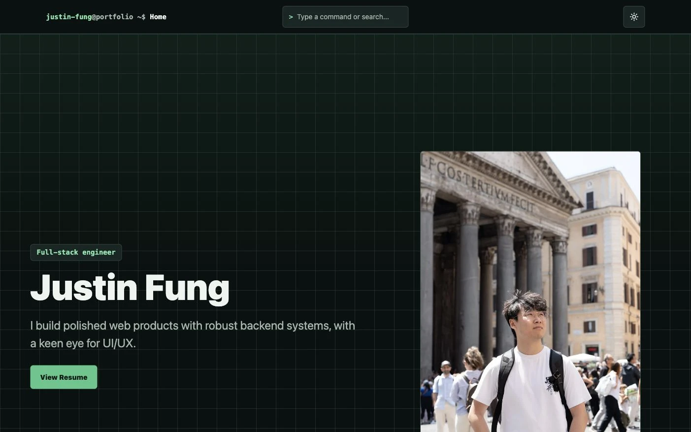

# Portfolio Website



A single-page portfolio website for myself, built with accessible navigation, responsive content sections, semantic HTML, SEO metadata, and crawlable project evidence.

## What It Includes

- Command Navigation for jumping between the Portfolio sections.
- Experience Timeline with supplied evidence screenshots and an inspectable Evidence Viewer.
- Personal Projects cards with repository links, tags, and project screenshots where available.
- Responsive hero, navigation, project, skills, languages, soft-skills, and contact sections.
- Accessibility-minded controls, labels, focus targets, and reduced-motion coverage.
- SEO metadata, JSON-LD identity data, `robots.txt`, and `sitemap.xml`.

## Stack

- Astro 6
- React 19 islands
- TypeScript
- Tailwind CSS
- Lucide React icons
- Playwright end-to-end tests

## Local Development

```sh
npm install
npm run dev
```

The dev server runs at `http://localhost:4321` by default.

## Checks

```sh
npm run build
npm run test:e2e
```

`npm run build` runs Astro type checking, builds the static output, and then runs the repo's static portfolio checks.

## Project Structure

- `src/pages/index.astro` defines the page shell, SEO metadata, and JSON-LD.
- `src/components/portfolio/content.ts` owns the Portfolio content model.
- `src/components/portfolio/atoms`, `molecules`, and `organisms` contain the component layers.
- `src/assets/images` stores raster images that Astro optimizes at build time.
- `public/assets` stores stable public files such as logos and the resume PDF.
- `tests/portfolio.spec.ts` covers crawlable content, navigation behavior, responsive layout, and theme persistence.
